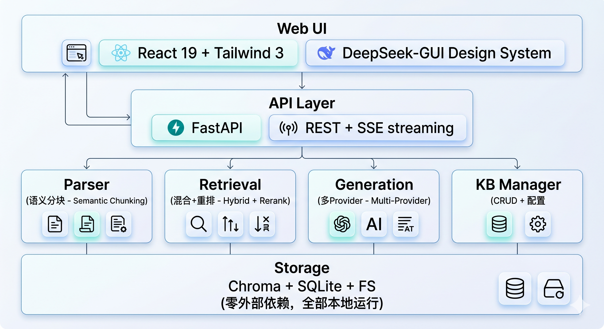
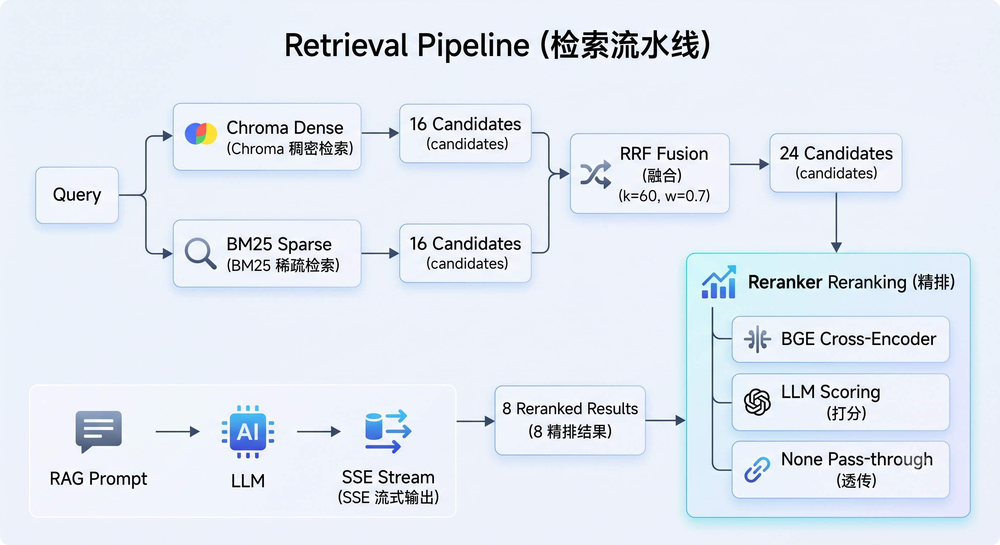

<div align="center">


</div>

<br>

# CazzKB

> 你私有的 AI 知识库助手 — 语义检索 × 混合重排 × 多模型对话

**CazzKB** 是轻量级、零外部依赖、可完全本地部署的个人知识库系统。上传 Markdown 文档，用自然语言与你的知识对话。前端照搬 DeepSeek-GUI 设计系统，后端纯 Python 实现，所有数据 100% 留在你的机器上。

<p align="center">
  
  
  
  
</p>

---

## 架构

<p align="center">
  
</p>

### 核心模块

| 模块 | 技术栈 | 特性 |
|------|--------|------|
| **Ingestion** | Python · python-frontmatter | YAML 元数据提取 · 代码块/表格/公式保护 · Mermaid 识别 · header-path 层级追踪 |
| **Chunker** | Semantic Chunker | 两步分块（元素提取→智能合并） · CJK token 估算 · Protected Range · 重叠窗口 |
| **Retrieval** | Chroma + BM25 + RRF | Dense 向量 + Sparse 关键词 → RRF k=60 融合 · Cross-Encoder Reranker 精排 |
| **LLM** | DeepSeek / Anthropic | Registry 工厂模式 · `auth_token` 兼容端点 · SSE 流式生成 · Thinking block 过滤 |
| **Embedding** | Ollama bge-m3 | 本地 1024 维向量 · 中英多语言 · 零 API 费用 · 8K 上下文窗口 |
| **Frontend** | React 19 + Zustand 5 | 消息编辑回退 · 时间分组历史 · Markdown 代码高亮 · 响应时间显示 |

---

## 快速开始

### 前置条件

| 依赖 | 用途 | 安装 |
|------|------|------|
| Python 3.11+ | 后端 | `conda create -n cazzkb python=3.11` |
| Node.js 18+ | 前端 | `winget install OpenJS.NodeJS` |
| Ollama | 本地 Embedding | `winget install Ollama.Ollama` |

### 1. 启动 Ollama & 拉取模型

```bash
# 启动 Ollama 服务
ollama serve

# 拉取中文最强嵌入模型
ollama pull bge-m3
```

> `bge-m3` 在 C-MTEB 中文榜单排名第一，1024 维，1.2GB 显存。如果你有 8GB+ 内存的机器，这是零成本的最优选择。

### 2. 安装后端

```bash
git clone https://github.com/YangCazz/CazzKB.git
cd CazzKB/backend

# 创建 conda 环境
conda create -n cazzkb python=3.11 -y
conda activate cazzkb

# 安装依赖
uv pip install -r requirements.txt
```

### 3. 配置

```bash
# 复制配置模板
cp .env.example .env
```

编辑 `.env`，填入你的 API key：

```env
DEEPSEEK_API_KEY=sk-your-deepseek-key
```

编辑 `config/default.yaml` 选择 LLM 和 Embedding：

```yaml
llm:
  factory: "anthropic"                      # anthropic → DeepSeek 兼容端点
  model: "deepseek-v4-pro[1m]"
  base_url: "https://api.deepseek.com/anthropic"

embedding:
  factory: "ollama"                         # ollama → 本地免费
  model: "bge-m3"
```

> `.env` 已在 `.gitignore` 中，不会被提交。`config/default.yaml` 中的 API key 使用 `${VAR}` 占位符从环境变量注入。

### 4. 启动

```bash
# Terminal 1 — 后端 (backend/ 目录下)
uvicorn app.main:app --reload --port 8000

# Terminal 2 — 前端 (frontend/ 目录下)
npm install
npm run dev
```

打开 `http://localhost:5173`，创建知识库，上传 Markdown 文档，开始对话。

### 5. 导入博客 (可选)

```bash
cd backend
python scripts/ingest_blog.py
```

脚本会自动扫描 `_posts/` 目录，语义分块后批量入库。

---

## 纯本地部署

如果不想使用任何云 API：

| 组件 | 本地方案 | 配置 |
|------|----------|------|
| LLM | Ollama + qwen2.5 / deepseek-r1 | `llm.factory: ollama` (需添加 OllamaProvider) |
| Embedding | Ollama bge-m3 | `embedding.factory: ollama` ✓ |
| Reranker | FlagEmbedding bge-reranker-v2-m3 | `reranker.factory: bge` ✓ |

完全离线、零费用、零数据泄露。

---

## 检索流水线

<p align="center">
  
</p>

---

## 安全 & 隐私

- **所有数据本地存储**：Chroma 向量库 + SQLite 元数据 + 文件系统，均在 `backend/data/` 下
- **API key 不入库**：`.env` 已 gitignore，配置使用 `${ENV_VAR}` 占位符
- **Ollama 本地推理**：embedding 完全离线，文本永不离开你的机器
- **无遥测**：不收集任何使用数据，不连接任何统计服务

---

## API

| Method | Endpoint | 说明 |
|--------|----------|------|
| `POST`   | `/api/kb`                   | 创建知识库 |
| `GET`    | `/api/kb`                   | 列表知识库 |
| `GET`    | `/api/kb/{id}`              | 知识库详情 |
| `DELETE` | `/api/kb/{id}`              | 删除知识库 |
| `POST`   | `/api/kb/{id}/upload`       | 上传 Markdown |
| `GET`    | `/api/kb/{id}/chunks`       | 浏览分块 |
| `POST`   | `/api/kb/{id}/chat`         | 对话 (SSE) |
| `GET`    | `/api/kb/{id}/conversations`| 对话历史 |
| `GET`    | `/api/conversations/{id}`   | 对话详情 |
| `PATCH`  | `/api/conversations/{id}`   | 重命名对话 |
| `DELETE` | `/api/conversations/{id}`   | 删除对话 |

---

## 项目结构

```
CazzKB/
├── backend/
│   ├── app/
│   │   ├── api/              FastAPI routes + SSE
│   │   ├── ingestion/        Markdown parser + semantic chunker
│   │   ├── retrieval/        Embedding provider + BM25 + RRF + Reranker
│   │   ├── generation/       LLM provider abstraction + RAG prompts
│   │   ├── kb_manager/       Central orchestrator
│   │   └── models/           Peewee ORM (SQLite)
│   ├── config/default.yaml   全局配置
│   ├── scripts/              数据导入工具
│   └── tests/                测试套件
├── frontend/
│   └── src/
│       ├── components/
│       │   ├── chat/         MessageTimeline · FloatingComposer · ChatStarterGrid
│       │   ├── sidebar/      SidebarFrame · TreeRow · CommandRow · SearchField
│       │   └── shared/       CopyButton · DevBadge · MarkdownComponents
│       ├── store/            Zustand 5 chat-store
│       └── api/              REST + SSE client
├── docs/superpowers/         设计文档 & 实现计划
└── ref/                      参考项目 (不提交)
```

---

## 贡献

欢迎提 Issue 和 PR。

```bash
# 开发环境
cd backend && uv pip install -e ".[dev]"
cd frontend && npm install

# 跑测试
cd backend && python -m pytest tests/ -v --rootdir=.
```

---

## 路线图

| Phase | 状态 | 内容 |
|-------|------|------|
| **1. RAG** | ✓ 已完成 | 语义分块 + 混合检索 + Reranker + 多 Provider + Web UI |
| **2. Graph** | 计划中 | 引文知识图谱 · 实体关系查询 |
| **3. Agentic** | 计划中 | 自主多轮检索 · 工具调用 |
| **4. Memory** | 计划中 | 跨会话记忆 · Retrieval-free fallback |

---

## License

MIT © YangCazz
